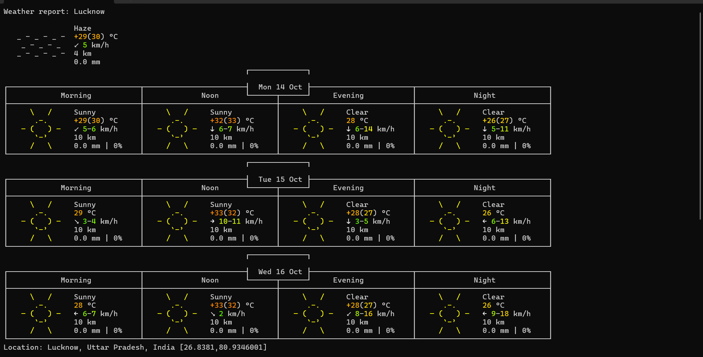

*wttr.in — the right way to ~check~ `curl` the weather!*

wttr.in is a console-oriented weather forecast service that supports various information
representation methods like terminal-oriented ANSI-sequences for console HTTP clients
(curl, httpie, or wget)
## Usage

You can access the service from a CMD like this:

    curl wttr.in/Lucknow
    Weather for City: Lucknow

         \   /     Haze
          .-.     +29(30)°C
       ― (   ) ―   ↙ 5 km/h
          `-’      4 km
         /   \     0.0 mm


Here is an example weather report:




Want to get the weather information for a specific location? You can add the desired location.

## Method 
*Open NotePad and the write code then save file with .bat extension and run it*

## Code 
```
@echo off
curl wttr.in/Lucknow
pause
```

